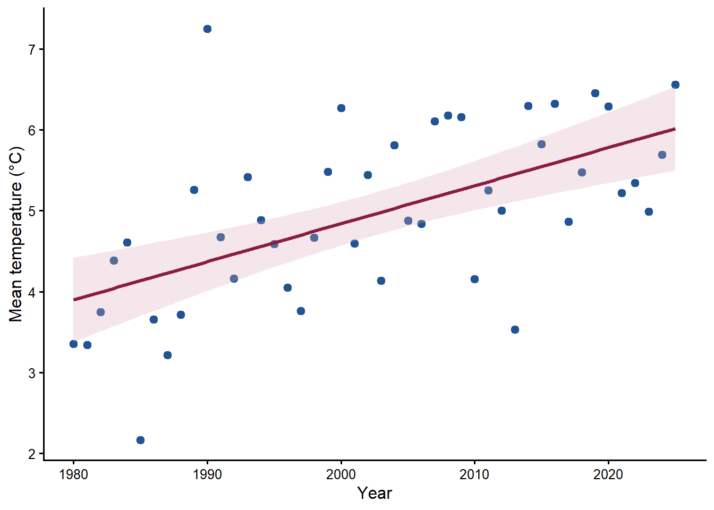
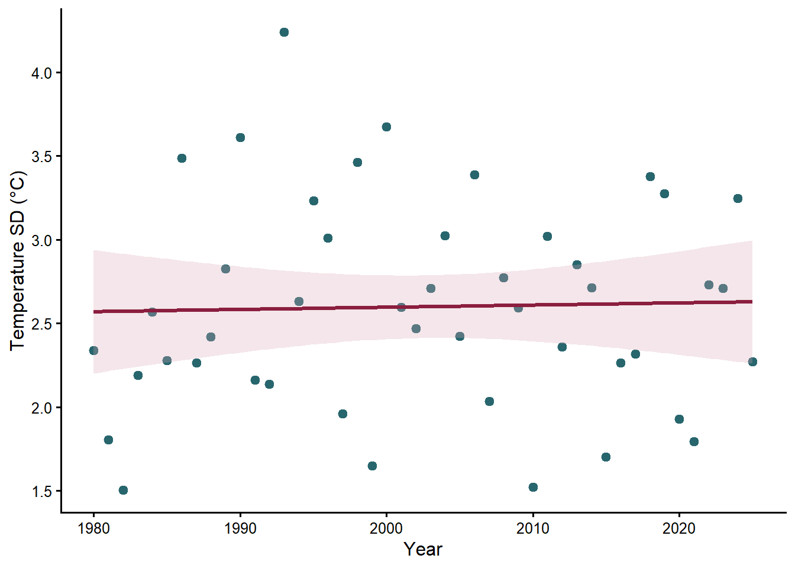

```{r}
#| echo: false
Sys.setlocale("LC_TIME", "C")
library(readr)
library(dplyr)
library(knitr)

annual_temperature <- read_csv(
  "data_derived/annual_main_window_temperature.csv",
  show_col_types = FALSE
)
```

## Temperature data

Daily mean air temperature was obtained from the SMHI Open Data API, parameter 2 (daily mean), for Hoburg (station 68550) and Hoburg A (station 68560). Coincident daily observations are averaged; otherwise the available station supplies the combined value. The combined calendar spans 1980-01-01 to 2025-12-31 and contains 16,802 days.

```{r}
#| eval: false
#| code-fold: show
#| filename: "R/02_prepare_temperature_data.R"
read_smhi <- function(path, station) {
  x <- read.delim(path, sep = ";", skip = 10, fileEncoding = "UTF-8-BOM",
                  check.names = FALSE, stringsAsFactors = FALSE)
  tibble(
    date = as.Date(x[[3]]),
    temperature = as.numeric(gsub(",", ".", x[[4]])),
    quality = x[[5]], station = station
  ) |>
    filter(!is.na(date), !is.na(temperature))
}

old <- read_smhi("data_raw/smhi/hoburg_68550_daily_mean_temperature.csv",
                 "Hoburg 68550")
new <- read_smhi("data_raw/smhi/hoburg_a_68560_daily_mean_temperature.csv",
                 "Hoburg A 68560")

daily <- full_join(
  old |> select(date, temp_old = temperature, q_old = quality),
  new |> select(date, temp_new = temperature, q_new = quality),
  by = "date"
) |>
  mutate(
    temperature = rowMeans(cbind(temp_old, temp_new), na.rm = TRUE),
    source = case_when(
      !is.na(temp_old) & !is.na(temp_new) ~ "mean of both stations",
      !is.na(temp_old) ~ "Hoburg 68550",
      TRUE ~ "Hoburg A 68560"
    )
  ) |>
  arrange(date)

calendar <- tibble(
  date = seq(as.Date("1980-01-01"), as.Date("2025-12-31"), by = "day")
) |>
  left_join(daily, by = "date")
write_csv(calendar, "data_derived/smhi_hoburg_daily_temperature.csv", na = "")
```

```{r}
#| echo: false
overlap_summary <- read_csv(
  "tables/smhi_hoburg_station_overlap_summary.csv",
  show_col_types = FALSE
)
kable(overlap_summary, digits = 4,
      caption = "Agreement between Hoburg and Hoburg A during their overlap")
```

[Download the combined daily temperature series](data_derived/smhi_hoburg_daily_temperature.csv){.btn .btn-primary download="smhi_hoburg_daily_temperature.csv"}

## Sliding-window selection

The unit of analysis is the breeding season. The response is annual raw median laying date, expressed relative to 1 May. The prespecified absolute reference day is 7 May.

```{r}
#| echo: false
settings <- read_csv("tables/climwin_settings.csv", show_col_types = FALSE)
kable(settings, col.names = c("Setting", "Prespecified value"),
      caption = "Prespecified sliding-window settings")
```

```{r}
#| eval: false
#| code-fold: show
#| filename: "R/04_climwin_laying_date.R"
library(climwin)

set.seed(20260808)
annual <- read_csv("data_derived/annual_raw_median_laying_date.csv",
                   show_col_types = FALSE) |>
  mutate(bdate = as.Date(bdate))
temperature <- read_csv("data_derived/smhi_hoburg_daily_temperature.csv",
                        show_col_types = FALSE) |>
  transmute(date = as.Date(date), temperature = as.numeric(temperature))
stopifnot(!anyDuplicated(temperature$date), all(diff(temperature$date) == 1))

refday <- c(7L, 5L)
baseline <- lm(median_LD ~ 1, data = annual)
main_win <- slidingwin(
  xvar = list(temperature = temperature$temperature),
  cdate = temperature$date, bdate = annual$bdate, baseline = baseline,
  type = "absolute", refday = refday, range = c(17, 0),
  stat = "mean", func = "lin", cinterval = "week"
)
main_rand <- randwin(
  repeats = 500, xvar = list(temperature = temperature$temperature),
  cdate = temperature$date, bdate = annual$bdate, baseline = baseline,
  type = "absolute", refday = refday, range = c(17, 0),
  stat = "mean", func = "lin", cinterval = "week"
)
P_delta_AICc <- pvalue(main_win[[1]]$Dataset, main_rand[[1]],
                       metric = "AIC", sample.size = nrow(annual))
P_c <- pvalue(main_win[[1]]$Dataset, main_rand[[1]],
              metric = "C", sample.size = nrow(annual))
saveRDS(main_win,
        "models/climwin/slidingwin_main_calendar_index_ref07may_range17w.rds")
saveRDS(main_rand,
        "models/climwin/randwin_main_calendar_index_ref07may_range17w_500.rds")
```

```{r}
#| echo: false
main_win <- readRDS("models/climwin/slidingwin_main_calendar_index_ref07may_range17w.rds")
main_rand <- readRDS("models/climwin/randwin_main_calendar_index_ref07may_range17w_500.rds")
windows <- read_csv("tables/climwin_windows.csv", show_col_types = FALSE)
kable(windows, digits = 3,
      caption = "Selected windows and their AICc improvement")
```

The main window was 6–0 weeks before 7 May, approximately 26 March–7 May. Window stability and the AICc improvement are retained in the table above.

```{r}
#| echo: false
med <- read_csv("tables/climwin_medwin.csv", show_col_types = FALSE)
kable(med, digits = 3,
      caption = "Median boundaries from medwin() for the 95% best-window set")
```

```{r}
#| echo: false
false_positive <- read_csv(
  "tables/climwin_false_positive_tests.csv",
  show_col_types = FALSE,
  col_types = cols(P_delta_AICc = col_character())
)
kable(false_positive, digits = 6,
      col.names = c("randwin repeats", "P(Delta AICc)", "Pc"),
      caption = "False-positive assessment from 500 randwin repetitions")
```

```{r}
#| echo: false
oos <- read_csv("tables/climwin_out_of_sample.csv", show_col_types = FALSE)
kable(oos, digits = 6,
      caption = "Out-of-sample evaluation in the remaining 22 seasons")
```

The held-out association does not confirm the direction selected in the training period: its temperature coefficient has the opposite sign. It is therefore not directional validation of the selected effect.

## Temperature in the selected window

For every year, `temp_mean` is the arithmetic mean and `temp_sd` is the sample standard deviation of the 43 daily means from 26 March through 7 May, including both endpoints.

```{r}
#| echo: false
temp_trends <- read_csv("tables/main_window_temperature_trends.csv",
                        show_col_types = FALSE)
kable(temp_trends, digits = 4,
      caption = "Trends in selected-window temperature mean and variability")
```

<details class="model-summary">
<summary>Show complete temporal-model summaries</summary>

```{r}
#| eval: false
#| code-fold: false
#| filename: "models/climwin/main_window_temperature_trends.rds"
temperature_models <- readRDS("models/climwin/main_window_temperature_trends.rds")
summary(temperature_models$mean_trend)
summary(temperature_models$sd_trend)
```

</details>

Mean temperature increased by `r formatC(temp_trends$beta_per_year[temp_trends$response == "temp_mean"], digits = 4, format = "f")`°C per year. The temporal trend in `temp_sd` was not supported.

```{r}
#| echo: false
temp_cor <- read_csv("tables/main_window_temperature_correlations.csv",
                     show_col_types = FALSE) |>
  filter(
    (variable_x == "temp_mean" & variable_y == "year") |
    (variable_x == "temp_sd" & variable_y == "year") |
    (variable_x == "temp_mean" & variable_y == "temp_sd")
  )
kable(temp_cor, digits = 4,
      caption = "Correlations among year, temp_mean, and temp_sd")
```

```{r}
#| echo: false
#| fig-cap: "Annual mean temperature in the 26 March–7 May window. The line and band show the linear trend and its 95% confidence interval."

```

[Show the plotting code in Figure code](figure_code.html#thermal-window-figures).

```{r}
#| echo: false
#| fig-cap: "Annual within-window temperature SD in the 26 March–7 May window."

```

[Show the plotting code in Figure code](figure_code.html#thermal-window-figures).

## Appendix

::: {.callout-note collapse="true"}
### March diagnostics

These retained diagnostics assess warm March days, March–April temperature correspondence, direct month-by-era terms, and continuous change in the selected-window slope. They do not redefine the selected window.

```{r}
#| echo: false
kable(read_csv("tables/march_warm_days_trend.csv", show_col_types = FALSE),
      digits = 4, caption = "Trends in counts of March days above fixed thresholds")
kable(read_csv("tables/march_april_temperature_correlations.csv", show_col_types = FALSE),
      digits = 4, caption = "March–April temperature correlations")
kable(read_csv("tables/march_april_correlation_difference.csv", show_col_types = FALSE),
      digits = 4, caption = "Comparison of March–April correlations")
kable(read_csv("tables/march_april_era_model_coefficients.csv", show_col_types = FALSE),
      digits = 4, caption = "March- and April-by-era model coefficients")
kable(read_csv("tables/march_april_era_slopes.csv", show_col_types = FALSE),
      digits = 4, caption = "Conditional monthly temperature slopes")
kable(read_csv("tables/march_april_era_joint_interaction_test.csv", show_col_types = FALSE),
      digits = 4, caption = "Joint test of temperature-by-era interactions")
kable(read_csv("tables/main_window_time_interaction_coefficients.csv", show_col_types = FALSE),
      digits = 4, caption = "Continuous selected-window temperature-by-time model")
kable(read_csv("tables/main_window_time_conditional_slopes.csv", show_col_types = FALSE),
      digits = 4, caption = "Conditional selected-window temperature slopes")
```

### Annual non-overlap check

```{r}
#| echo: false
overlap <- read_csv("tables/climwin_window_lay_overlap_by_year.csv",
                    show_col_types = FALSE) |>
  select(year, n_broods, p05_lay_calendar,
         window_close_calendar, window_reaches_p05_lay)
kable(overlap, caption = "Annual check that the selected window ends before laying")
```

The selected window closed before the annual fifth percentile of laying dates in all 45 seasons.

### Cached model objects

Cached model objects are retained locally and are not distributed with the public website.
:::

The thermal window was selected using the annual median laying date; its ability to explain between-year variation in reproductive traits is therefore an independent test and is reported in the three model-specific chapters.
