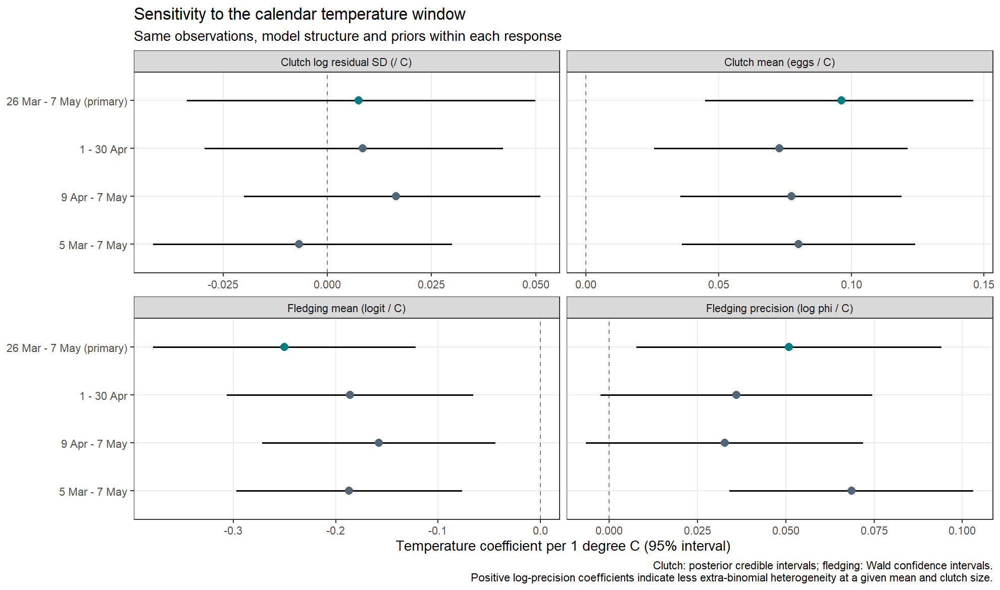

```{r}
#| echo: false
invisible(Sys.setlocale("LC_TIME", "C"))
library(readr)
library(dplyr)
library(knitr)

annual_temperature <- read_csv(
  "data_derived/annual_main_window_temperature.csv",
  show_col_types = FALSE
)
```

## Temperature data

Daily mean air temperature was obtained from the SMHI Open Data API, parameter 2 (daily mean), for Hoburg (station 68550) and Hoburg A (station 68560). Coincident daily observations are averaged; otherwise the available station supplies the combined value. The combined calendar spans 1980-01-01 to 2025-12-31 and contains 16,802 days.

```{r}
#| eval: false
#| code-fold: show
#| filename: "R/02_prepare_temperature_data.R"
read_smhi <- function(path, station) {
  x <- read.delim(path, sep = ";", skip = 10, fileEncoding = "UTF-8-BOM",
                  check.names = FALSE, stringsAsFactors = FALSE)
  tibble(
    date = as.Date(x[[3]]),
    temperature = as.numeric(gsub(",", ".", x[[4]])),
    quality = x[[5]], station = station
  ) |>
    filter(!is.na(date), !is.na(temperature))
}

old <- read_smhi("data_raw/smhi/hoburg_68550_daily_mean_temperature.csv",
                 "Hoburg 68550")
new <- read_smhi("data_raw/smhi/hoburg_a_68560_daily_mean_temperature.csv",
                 "Hoburg A 68560")

daily <- full_join(
  old |> select(date, temp_old = temperature, q_old = quality),
  new |> select(date, temp_new = temperature, q_new = quality),
  by = "date"
) |>
  mutate(
    temperature = rowMeans(cbind(temp_old, temp_new), na.rm = TRUE),
    source = case_when(
      !is.na(temp_old) & !is.na(temp_new) ~ "mean of both stations",
      !is.na(temp_old) ~ "Hoburg 68550",
      TRUE ~ "Hoburg A 68560"
    )
  ) |>
  arrange(date)

calendar <- tibble(
  date = seq(as.Date("1980-01-01"), as.Date("2025-12-31"), by = "day")
) |>
  left_join(daily, by = "date")
write_csv(calendar, "data_derived/smhi_hoburg_daily_temperature.csv", na = "")
```

```{r}
#| echo: false
overlap_summary <- read_csv(
  "tables/smhi_hoburg_station_overlap_summary.csv",
  show_col_types = FALSE
)
kable(overlap_summary, digits = 4,
      caption = "Agreement between Hoburg and Hoburg A during their overlap")
```

[Download the combined daily temperature series](data_derived/smhi_hoburg_daily_temperature.csv){.btn .btn-primary download="smhi_hoburg_daily_temperature.csv"}

## Sliding-window selection

The unit of analysis is the breeding season. The response is annual raw median laying date, expressed relative to 1 May. The prespecified absolute reference day is 7 May.

```{r}
#| echo: false
settings <- read_csv("tables/climwin_settings.csv", show_col_types = FALSE)
kable(settings, col.names = c("Setting", "Prespecified value"),
      caption = "Prespecified sliding-window settings")
```

```{r}
#| eval: false
#| code-fold: show
#| filename: "R/04_climwin_laying_date.R"
library(climwin)

set.seed(20260808)
annual <- read_csv("data_derived/annual_raw_median_laying_date.csv",
                   show_col_types = FALSE) |>
  mutate(bdate = as.Date(bdate))
temperature <- read_csv("data_derived/smhi_hoburg_daily_temperature.csv",
                        show_col_types = FALSE) |>
  transmute(date = as.Date(date), temperature = as.numeric(temperature))
stopifnot(!anyDuplicated(temperature$date), all(diff(temperature$date) == 1))

refday <- c(7L, 5L)
baseline <- lm(median_LD ~ 1, data = annual)
main_win <- slidingwin(
  xvar = list(temperature = temperature$temperature),
  cdate = temperature$date, bdate = annual$bdate, baseline = baseline,
  type = "absolute", refday = refday, range = c(17, 0),
  stat = "mean", func = "lin", cinterval = "week"
)
main_rand <- randwin(
  repeats = 500, xvar = list(temperature = temperature$temperature),
  cdate = temperature$date, bdate = annual$bdate, baseline = baseline,
  type = "absolute", refday = refday, range = c(17, 0),
  stat = "mean", func = "lin", cinterval = "week"
)
P_delta_AICc <- pvalue(main_win[[1]]$Dataset, main_rand[[1]],
                       metric = "AIC", sample.size = nrow(annual))
P_c <- pvalue(main_win[[1]]$Dataset, main_rand[[1]],
              metric = "C", sample.size = nrow(annual))
saveRDS(main_win,
        "models/climwin/slidingwin_main_calendar_index_ref07may_range17w.rds")
saveRDS(main_rand,
        "models/climwin/randwin_main_calendar_index_ref07may_range17w_500.rds")
```

```{r}
#| echo: false
main_win <- readRDS("models/climwin/slidingwin_main_calendar_index_ref07may_range17w.rds")
main_rand <- readRDS("models/climwin/randwin_main_calendar_index_ref07may_range17w_500.rds")
windows <- read_csv("tables/climwin_windows.csv", show_col_types = FALSE)
kable(windows, digits = 3,
      caption = "Selected windows and their AICc improvement")
```

The weekly search selected offsets 6–0 relative to the week containing 7 May. Because `climwin` uses complete seven-day calendar bins, its actual temperature dates were 26 March–13 May in non-leap years and 25 March–12 May in leap years. The reproductive models operationalised these offsets as a fixed daily interval, 26 March–7 May (43 days). These are distinct aggregations; the fixed daily interval is retained as the primary reproductive predictor and compared with three prespecified alternative calendar windows below.

```{r}
#| echo: false
med <- read_csv("tables/climwin_medwin.csv", show_col_types = FALSE)
kable(med, digits = 3,
      caption = "Median boundaries from medwin() for the 95% best-window set")
```

```{r}
#| echo: false
false_positive <- read_csv(
  "tables/climwin_false_positive_tests.csv",
  show_col_types = FALSE,
  col_types = cols(P_delta_AICc = col_character())
)
kable(false_positive, digits = 6,
      col.names = c("randwin repeats", "P(Delta AICc)", "Pc"),
      caption = "False-positive assessment from 500 randwin repetitions")
```

```{r}
#| echo: false
oos <- read_csv("tables/climwin_out_of_sample.csv", show_col_types = FALSE)
kable(oos, digits = 6,
      caption = "Out-of-sample evaluation in the remaining 22 seasons")
```

An audit identified an indexing error in `singlewin`'s absolute weekly branch: the reference index used the month number plus 53 times the year offset, whereas climate records used the week number plus 52 times the year offset. Reproducing that error recovered the former positive coefficient exactly. Explicit extraction using the same weekly bins as the training `slidingwin` gives a negative held-out association (beta = -1.566 days per degree C; 95% t interval -2.734 to -0.397; p = 0.011; R-squared = 0.281). Thus the previously reported reversal was computational, not evidence of a biological reversal.

This coefficient is estimated in the test subset with the window held fixed; it is not itself a prediction score. Applying the training intercept and slope unchanged to the 22 test seasons gives RMSE 3.187 days, compared with 5.226 days for the training-mean baseline, and mean prediction bias +1.521 days. The association remains negative but is weaker than in training, so the result does not establish identical effect magnitude across periods.

## Temperature in the selected window

For every year, `temp_mean` is the arithmetic mean and `temp_sd` is the sample standard deviation of the 43 daily means from 26 March through 7 May, including both endpoints.

```{r}
#| echo: false
temp_trends <- read_csv("tables/main_window_temperature_trends.csv",
                        show_col_types = FALSE)
kable(temp_trends, digits = 4,
      caption = "Trends in mean temperature and day-to-day thermal variability within the selected window")
```

<details class="model-summary">
<summary>Show complete temporal-model summaries</summary>

```{r}
#| eval: false
#| code-fold: false
#| filename: "models/climwin/main_window_temperature_trends.rds"
temperature_models <- readRDS("models/climwin/main_window_temperature_trends.rds")
summary(temperature_models$mean_trend)
summary(temperature_models$sd_trend)
```

</details>

Mean temperature increased by `r formatC(temp_trends$beta_per_year[temp_trends$response == "temp_mean"], digits = 4, format = "f")`°C per year. We found no evidence of a temporal trend in day-to-day thermal variability within the window, measured as the annual standard deviation of daily mean temperatures (`temp_sd`). This single measure does not establish whether broader climate predictability changed.

```{r}
#| echo: false
temp_cor <- read_csv("tables/main_window_temperature_correlations.csv",
                     show_col_types = FALSE) |>
  filter(
    (variable_x == "temp_mean" & variable_y == "year") |
    (variable_x == "temp_sd" & variable_y == "year") |
    (variable_x == "temp_mean" & variable_y == "temp_sd")
  )
kable(temp_cor, digits = 4,
      caption = "Correlations among year, temp_mean, and temp_sd")
```

```{r}
#| echo: false
#| fig-cap: "Annual mean temperature in the 26 March–7 May window. The line and band show the linear trend and its 95% confidence interval."
knitr::include_graphics("figures/Fig1_temperature_mean_time.png")
```

[Show the plotting code in Figure code](figure_code.html#thermal-window-figures).

```{r}
#| echo: false
#| fig-cap: "Annual within-window temperature SD in the 26 March–7 May window."
knitr::include_graphics("figures/Fig1_temperature_sd_time.png")
```

[Show the plotting code in Figure code](figure_code.html#thermal-window-figures).

## Sensitivity of reproductive associations to the calendar interval

The primary daily interval (26 March–7 May; 43 days) was retained. Before inspecting the sensitivity results, three alternatives were fixed: all of April (30 days), 9 April–7 May (29 days), and 5 March–7 May (64 days). For each interval, annual mean daily temperature replaced the primary temperature predictor in both location and scale submodels. Within each response, observations, other covariates, random-effect structures and priors were unchanged. All intervals were retained in the comparison; none was chosen on the basis of its effect estimate or significance.

```{r}
#| echo: false
sensitivity <- read_csv("tables/window_sensitivity_comparison.csv", show_col_types = FALSE)
kable(sensitivity |> select(window, component, estimate, lower95, upper95, interval_type),
      digits = 3, caption = "Temperature coefficients per 1 degree C across predefined calendar intervals")
```

```{r}
#| echo: false
#| fig-cap: "Calendar-window sensitivity. Points and intervals show temperature coefficients per 1 degree C and 95% intervals. Clutch models use posterior credible intervals; fledging models use Wald confidence intervals. The primary interval is highlighted."

```

The mean fledging-success association was negative for all four intervals. Precision coefficients were positive throughout, but their intervals included zero for April and the shorter interval. This warrants more caution about the robustness of the precision association; crossing zero in some intervals does not itself demonstrate a difference between coefficients. The overlapping windows are correlated summaries of the same seasons, not independent replications. Positive precision coefficients refer to reduced extra-binomial heterogeneity at a given mean and clutch size, not necessarily reduced raw variance.

We therefore retain 26 March–7 May as the primary reproductive window; the alternatives are sensitivity checks, not candidates for post hoc selection.

The Bayesian clutch fits retain the original Gaussian model, including year-level random intercepts in both location and log residual SD. Female Gaussian random intercepts are integrated analytically with the exact marginal likelihood. The primary-window posterior is checked against the original `brms` output. Full convergence checks, computational-equivalence checks and coefficients scaled by the between-year temperature SD are retained in the sensitivity tables and local audit report.

## Appendix

::: {.callout-note collapse="true"}
### March diagnostics

These retained diagnostics assess warm March days, March–April temperature correspondence, direct month-by-era terms, and continuous change in the selected-window slope. They do not redefine the selected window.

```{r}
#| echo: false
kable(read_csv("tables/march_warm_days_trend.csv", show_col_types = FALSE),
      digits = 4, caption = "Trends in counts of March days above fixed thresholds")
kable(read_csv("tables/march_april_temperature_correlations.csv", show_col_types = FALSE),
      digits = 4, caption = "March–April temperature correlations")
kable(read_csv("tables/march_april_correlation_difference.csv", show_col_types = FALSE),
      digits = 4, caption = "Comparison of March–April correlations")
kable(read_csv("tables/march_april_era_model_coefficients.csv", show_col_types = FALSE),
      digits = 4, caption = "March- and April-by-era model coefficients")
kable(read_csv("tables/march_april_era_slopes.csv", show_col_types = FALSE),
      digits = 4, caption = "Conditional monthly temperature slopes")
kable(read_csv("tables/march_april_era_joint_interaction_test.csv", show_col_types = FALSE),
      digits = 4, caption = "Joint test of temperature-by-era interactions")
kable(read_csv("tables/main_window_time_interaction_coefficients.csv", show_col_types = FALSE),
      digits = 4, caption = "Continuous selected-window temperature-by-time model")
kable(read_csv("tables/main_window_time_conditional_slopes.csv", show_col_types = FALSE),
      digits = 4, caption = "Conditional selected-window temperature slopes")
```

### Annual fifth-percentile check for the fixed daily reproductive predictor

```{r}
#| echo: false
overlap <- read_csv("tables/climwin_window_lay_overlap_by_year.csv",
                    show_col_types = FALSE) |>
  select(year, n_broods, p05_lay_calendar,
         window_close_calendar, window_reaches_p05_lay)
kable(overlap, caption = "Closing date of the fixed daily interval versus the annual fifth percentile")
```

The fixed daily reproductive interval closed before the annual fifth percentile of laying dates in all 45 seasons. This does not establish non-overlap with every brood: two of 14,297 breeding attempts began before 7 May (6 May 2006 and 28 April 2022). This check concerns the fixed daily interval, not the full weekly bins used by the phenology search.

### Cached model objects

Cached model objects are retained locally and are not distributed with the public website.
:::

The thermal window search used annual median laying date rather than either reproductive response. This reduces direct selection on the reproductive outcomes, but the subsequent analyses use the same population and overlapping seasons and should not be described as independent validation.
