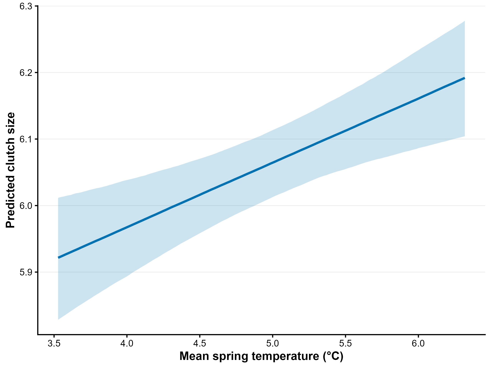
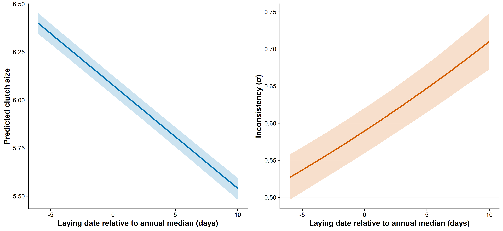
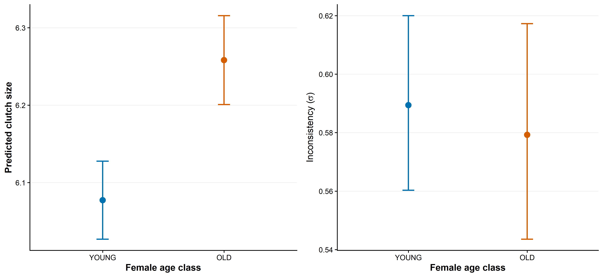
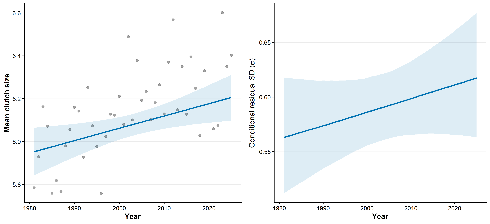

```{r}
#| label: setup
#| include: false
Sys.setlocale("LC_TIME", "C")
library(dplyr)
library(knitr)
library(readr)

fmt <- function(x, digits = 3) formatC(x, digits = digits, format = "f")
fmt_p <- function(x) ifelse(x < 0.001, "< 0.001", paste0("= ", fmt(x, 3)))

sample_tab <- read_csv("tables/clutch_chapter_sample_summary.csv", show_col_types = FALSE)
scale_test <- read_csv("tables/clutch_size_scale_model_comparison.csv", show_col_types = FALSE)
coef_cs <- read_csv("tables/brms_cs_main_no_tempsd_coefficients.csv", show_col_types = FALSE)
variance_decomp <- read_csv("tables/clutch_variance_decomposition.csv", show_col_types = FALSE)
diagnostics <- read_csv("tables/brms_cs_main_no_tempsd_full_diagnostics.csv", show_col_types = FALSE)
temporal_change <- read_csv("tables/clutch_temporal_change_summary.csv", show_col_types = FALSE)

loc <- coef_cs |> filter(component == "location")
sca <- coef_cs |> filter(component == "scale_log_sigma")
```

## Data

Run the following files in order:

1. [`R/32_main_structure_tests_no_tempsd.R`](R/32_main_structure_tests_no_tempsd.R) — runs the Gaussian `glmmTMB` structure comparison using the prespecified main-model predictors.
2. [`R/26_brms_clutch_main_no_tempsd_totoro.R`](R/26_brms_clutch_main_no_tempsd_totoro.R) — fits and saves the main Bayesian location-scale model.
3. [`R/31_clutch_chapter_outputs.R`](R/31_clutch_chapter_outputs.R) — reads the saved model and creates coefficient tables, plotting data, and figures.
4. [`clutch_size.qmd`](clutch_size.qmd) — reads the cached outputs and renders this chapter.

The analyses use `data_derived/clutch_size_model_data.csv`. The data span `r sample_tab$first_year`–`r sample_tab$last_year` (`r sample_tab$seasons` seasons) and contain `r format(sample_tab$broods, big.mark = ",")` broods from `r format(sample_tab$females, big.mark = ",")` females. The observed clutch-size range is `r sample_tab$clutch_min`–`r sample_tab$clutch_max`. The pilot season 1980 and the unmonitored season 2020 are absent. `temp_mean_c` and `year_c` are centred on the means of this subset.

| Years | Seasons | Broods | Females | Clutch-size range |
|---|---:|---:|---:|---:|
| `r paste0(sample_tab$first_year, "–", sample_tab$last_year)` | `r sample_tab$seasons` | `r format(sample_tab$broods, big.mark = ",")` | `r format(sample_tab$females, big.mark = ",")` | `r paste0(sample_tab$clutch_min, "–", sample_tab$clutch_max)` |

## Model structure test

**Data.** Both Gaussian `glmmTMB` models use the full clutch-size dataset and identical location formulas.

**Model code.**

```{r}
#| eval: false
#| code-fold: true
#| code-summary: "Show model call"
#| filename: "R/32_main_structure_tests_no_tempsd.R"
library(glmmTMB)
library(readr)
library(dplyr)
dat <- read_csv("data_derived/clutch_size_model_data.csv", show_col_types = FALSE) |>
  mutate(age_class = factor(age_class, levels = c("YOUNG", "OLD")),
         female_id = factor(female_id), year_f = factor(year_f))
m_constant <- glmmTMB(
  clutch ~ rel_LD + temp_mean_c + year_c + age_class +
    (1 | female_id) + (1 | year_f),
  dispformula = ~1, family = gaussian(), data = dat
)
m_scale <- update(
  m_constant,
  dispformula = ~ rel_LD + temp_mean_c + year_c + age_class
)
```

**Model summary.**

```{r}
#| echo: true
kable(scale_test, digits = 3,
      col.names = c("Model", "df", "AIC", "BIC", "logLik", "Deviance",
                    "Chi-square", "df (LRT)", "p", "Delta AIC", "Delta BIC"),
      caption = "Constant-scale and location-scale Gaussian models for clutch size.")
```

The location-scale model reduced AIC by `r fmt(scale_test$delta_AIC[scale_test$model == "Constant scale"], 1)` and the likelihood-ratio test gave $\chi^2_{`r scale_test$chi_df[scale_test$model == "Location-scale"]`}$ = `r fmt(scale_test$chi_square[scale_test$model == "Location-scale"], 1)`, $p$ `r fmt_p(scale_test$p[scale_test$model == "Location-scale"])`. The strong improvement in fit supported predictor-dependent residual scale. The Bayesian main model therefore retained these scale predictors and additionally allowed residual scale to vary among years through a year-level random intercept.

## Main Gaussian location-scale model

**Data.** The Bayesian model uses the same full dataset, with the age class from the existing binary `age_class` column.

The predictors operate at different hierarchical levels. Relative laying date is centred within season and is therefore identified primarily by comparisons among broods breeding in the same year; the model contains `r format(sample_tab$broods, big.mark = ",")` brood records, with repeated observations of females accounted for by the female random intercept. Spring temperature and year vary only among seasons, so inference for these predictors is based on variation across `r sample_tab$seasons` breeding seasons. Consequently, annual predictors are estimated from substantially fewer independent temporal units than within-season predictors.

Here `rel_LD` is laying date minus the annual median laying date, calculated in the validated reproductive dataset before the final clutch-model restrictions. Within-season centring separates variation in reproductive timing among females within a season from differences among seasons. It does not impose exact orthogonality in the final analytical sample: the observed individual-level correlations were 0.036 with spring temperature and 0.030 with year.

**Model code.**

```{r}
#| eval: false
#| code-fold: true
#| code-summary: "Show model call"
#| filename: "R/26_brms_clutch_main_no_tempsd_totoro.R"
library(brms)
library(readr)
library(dplyr)

dat <- read_csv("data_derived/clutch_size_model_data.csv", show_col_types = FALSE) |>
  mutate(age_class = factor(age_class, levels = c("YOUNG", "OLD")),
         female_id = factor(female_id), year_f = factor(year_f))

priors_cs <- c(
  prior(normal(6, 2), class = "Intercept"),
  prior(normal(0, 0.5), class = "b"),
  prior(exponential(2), class = "sd"),
  prior(normal(-0.2, 0.5), class = "Intercept", dpar = "sigma"),
  prior(normal(0, 0.3), class = "b", dpar = "sigma"),
  prior(exponential(5), class = "sd", dpar = "sigma")
)

m_cs <- brm(
  bf(
    clutch ~ rel_LD + temp_mean_c + year_c + age_class +
      (1 | female_id) + (1 | year_f),
    sigma ~ rel_LD + temp_mean_c + year_c + age_class + (1 | year_f)
  ),
  family = gaussian(), prior = priors_cs, data = dat,
  backend = "cmdstanr", chains = 4, cores = 4,
  iter = 4000, warmup = 2000,
  control = list(adapt_delta = 0.99, max_treedepth = 15),
  seed = 1981, init = 0, save_pars = save_pars(all = TRUE)
)
saveRDS(m_cs, "models/brms/clutch_size_main_no_tempsd_full.rds")
```

Fitting took `r fmt(diagnostics$elapsed_minutes, 1)` minutes on the TOTORO server; the cached object is stored at `models/brms/clutch_size_main_no_tempsd_full.rds`.

```{r}
#| echo: true
#| code-fold: true
#| code-summary: "Load saved model"
m_cs <- readRDS("models/brms/clutch_size_main_no_tempsd_full.rds")
```

**Model summary.** The location coefficients are in clutch-size units. Scale coefficients are on the log-$\sigma$ scale; higher $\sigma$ means greater residual dispersion and therefore lower consistency. Posterior medians and exact 95% credible intervals are reported.

<details class="model-summary">
<summary>Show complete model summary</summary>

```{r}
#| eval: false
#| code-fold: false
summary(m_cs)
```

```{r}
#| echo: true
#| code-fold: true
kable(coef_cs |> select(component, term, median, CI_low, CI_high, Rhat, Bulk_ESS, Tail_ESS),
      digits = 4,
      col.names = c("Component", "Term", "Posterior median", "95% CrI low",
                    "95% CrI high", "R-hat", "Bulk ESS", "Tail ESS"),
      caption = "Complete coefficient table for the main clutch-size model, including the annual random-effect SD in sigma.")
```

</details>

**Create result tables and prediction data.** This step reads the saved TOTORO model; it does not refit it.

```{r}
#| eval: false
#| code-fold: true
#| code-summary: "Show output-generation step"
#| filename: "R/31_clutch_chapter_outputs.R"
source("R/31_clutch_chapter_outputs.R")
```

## Between-year and between-female variation

```{r}
#| echo: false
kable(
  variance_decomp |> filter(grepl("random-intercept SD", quantity)), digits = 3,
  col.names = c("Component", "Quantity", "Estimate", "Scale or unit"),
  caption = "Random-effect standard deviations in the clutch-size location and scale components."
)
```

In the location component, the female random-intercept SD was `r fmt(variance_decomp$estimate[variance_decomp$quantity == "Female random-intercept SD" & variance_decomp$component == "Location"], 3)` eggs and the year random-intercept SD was `r fmt(variance_decomp$estimate[variance_decomp$quantity == "Year random-intercept SD" & variance_decomp$component == "Location"], 3)` eggs. The year-level SD in the log-$\sigma$ component was `r fmt(variance_decomp$estimate[variance_decomp$quantity == "Year random-intercept SD" & variance_decomp$component == "Scale"], 3)`. These are conditional random-effect standard deviations rather than a formal partition of total phenotypic variance.

The female-level component is estimated from an average of 1.4 broods per female, and only 29% of females contributed more than one record. It should therefore be interpreted with caution, as with limited repeated measures this component may absorb variation that cannot be separated from residual variation.

::: {.callout-note collapse="true" title="Diagnostics"}

```{r}
#| echo: true
kable(diagnostics, digits = 3,
      caption = "Sampling diagnostics for the full clutch-size model.")
```

:::

### Clutch size and spring temperature

```{r}
#| echo: false
#| fig-cap: "Population-level predictions against spring temperature from the Gaussian location-scale model. Left: mean clutch size. Right: residual inconsistency, expressed as sigma. Random effects are excluded; ribbons are 95% credible intervals."

```

[Show the plotting code in Figure code](figure_code.html#clutch-size-figures).

Mean clutch size changed by $\beta$ = `r fmt(loc$median[loc$term == "temp_mean_c"], 3)` per °C (95% CrI `r fmt(loc$CI_low[loc$term == "temp_mean_c"], 3)` to `r fmt(loc$CI_high[loc$term == "temp_mean_c"], 3)`).

The temperature effect on residual scale was not supported ($\beta_{\log\sigma}$ = `r fmt(sca$median[sca$term == "temp_mean_c"], 3)`, 95% CrI `r fmt(sca$CI_low[sca$term == "temp_mean_c"], 3)` to `r fmt(sca$CI_high[sca$term == "temp_mean_c"], 3)`).

### Clutch size and inconsistency across relative laying date

```{r}
#| echo: false
#| fig-cap: "Population-level predictions against relative laying date from the Gaussian location-scale model. Left: mean clutch size. Right: residual inconsistency, expressed as sigma. Random effects are excluded; ribbons are 95% credible intervals."

```

[Show the plotting code in Figure code](figure_code.html#clutch-size-figures).

Mean clutch size declined with relative laying date ($\beta$ = `r fmt(loc$median[loc$term == "rel_LD"], 4)`, 95% CrI `r fmt(loc$CI_low[loc$term == "rel_LD"], 4)` to `r fmt(loc$CI_high[loc$term == "rel_LD"], 4)`). Residual SD changed by `r fmt(100 * (exp(sca$median[sca$term == "rel_LD"]) - 1), 1)`% per day of relative laying-date delay ($\beta$ = `r fmt(sca$median[sca$term == "rel_LD"], 4)`, 95% CrI `r fmt(sca$CI_low[sca$term == "rel_LD"], 4)` to `r fmt(sca$CI_high[sca$term == "rel_LD"], 4)`); higher values indicate lower consistency.

### Clutch size and female age

```{r}
#| echo: false
#| fig-cap: "Model-estimated mean clutch size (left) and residual inconsistency, expressed as sigma (right), for young and old females at the reference relative laying date, mean spring temperature, and mean study year. Points are predictions and error bars are 95% uncertainty intervals; random effects are excluded."

```

[Show the plotting code in Figure code](figure_code.html#female-age-and-clutch-size).

Clutch size was higher among older than young females at the reference values of the continuous predictors. Broods produced by older females contained on average `r fmt(loc$median[loc$term == "age_classOLD"], 3)` more eggs (95% CrI `r fmt(loc$CI_low[loc$term == "age_classOLD"], 3)` to `r fmt(loc$CI_high[loc$term == "age_classOLD"], 3)`). This is a contrast between age classes and does not estimate how an individual female's clutch size changes as she ages. The age-class difference in residual scale was not supported ($\beta_{\log\sigma}$ = `r fmt(sca$median[sca$term == "age_classOLD"], 3)`, 95% CrI `r fmt(sca$CI_low[sca$term == "age_classOLD"], 3)` to `r fmt(sca$CI_high[sca$term == "age_classOLD"], 3)`).

### Long-term temporal trends

We examined temporal change in clutch size and reproductive consistency after accounting for spring temperature.

```{r}
#| echo: false
#| fig-cap: "Temporal predictions from the Gaussian location-scale model after accounting for spring temperature. Left: observed annual mean clutch size (grey points) and the population-level conditional temporal prediction. Right: conditional residual SD (sigma); higher values indicate lower reproductive consistency. Spring temperature is held at its study-wide mean, random effects are excluded, and ribbons show 95% credible intervals."

```

[Show the plotting code in Figure code](figure_code.html#clutch-size-figures).

After accounting for spring temperature, mean clutch size showed a small positive temporal trend ($\beta_{\mathrm{year}}$ = `r fmt(loc$median[loc$term == "year_c"], 4)`, 95% CrI `r fmt(loc$CI_low[loc$term == "year_c"], 4)` to `r fmt(loc$CI_high[loc$term == "year_c"], 4)`). The conditional predicted change from 1981 to 2025 was `r fmt(temporal_change$estimate[temporal_change$component == "Mean clutch size" & grepl("Conditional", temporal_change$prediction)], 3)` eggs (95% CrI `r fmt(temporal_change$CI_low[temporal_change$component == "Mean clutch size" & grepl("Conditional", temporal_change$prediction)], 3)` to `r fmt(temporal_change$CI_high[temporal_change$component == "Mean clutch size" & grepl("Conditional", temporal_change$prediction)], 3)`).

The temporal effect on residual scale was not clearly supported ($\beta_{\mathrm{year}(\log\sigma)}$ = `r fmt(sca$median[sca$term == "year_c"], 4)`, 95% CrI `r fmt(sca$CI_low[sca$term == "year_c"], 4)` to `r fmt(sca$CI_high[sca$term == "year_c"], 4)`). Across the study period, the conditional predicted change in $\sigma$ was `r fmt(temporal_change$estimate[temporal_change$component == "Residual scale" & grepl("Conditional", temporal_change$prediction)], 1)`% (95% CrI `r fmt(temporal_change$CI_low[temporal_change$component == "Residual scale" & grepl("Conditional", temporal_change$prediction)], 1)` to `r fmt(temporal_change$CI_high[temporal_change$component == "Residual scale" & grepl("Conditional", temporal_change$prediction)], 1)`%). This interval included zero; higher $\sigma$ indicates lower reproductive consistency.

## Figure data and reproducibility

Each figure is accompanied by its plotting data:

- [Figure 4.1 mean data](tables/fig4_1_clutch_temperature.csv){download="fig4_1_clutch_temperature.csv"}
- [Figure 4.1 scale data](tables/fig4_1b_sigma_temperature.csv){download="fig4_1b_sigma_temperature.csv"}
- [Figure 4.2 mean data](tables/fig4_2a_clutch_rellD.csv){download="fig4_2a_clutch_rellD.csv"}
- [Figure 4.2 scale data](tables/fig4_2b_sigma_rellD.csv){download="fig4_2b_sigma_rellD.csv"}
- [Figure 4.3 mean data](tables/fig4_3a_clutch_age.csv){download="fig4_3a_clutch_age.csv"}
- [Figure 4.3 scale data](tables/fig4_3b_sigma_age.csv){download="fig4_3b_sigma_age.csv"}
- [Figure 4.4 mean data](tables/fig4_4a_annual_clutch.csv){download="fig4_4a_annual_clutch.csv"}
- [Figure 4.4 scale data](tables/fig4_4b_annual_sigma.csv){download="fig4_4b_annual_sigma.csv"}
- [Figure 4.4 temporal-change summary](tables/clutch_temporal_change_summary.csv){download="clutch_temporal_change_summary.csv"}
