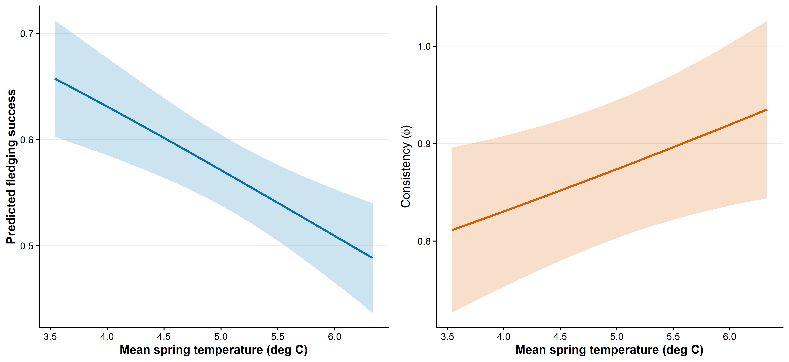
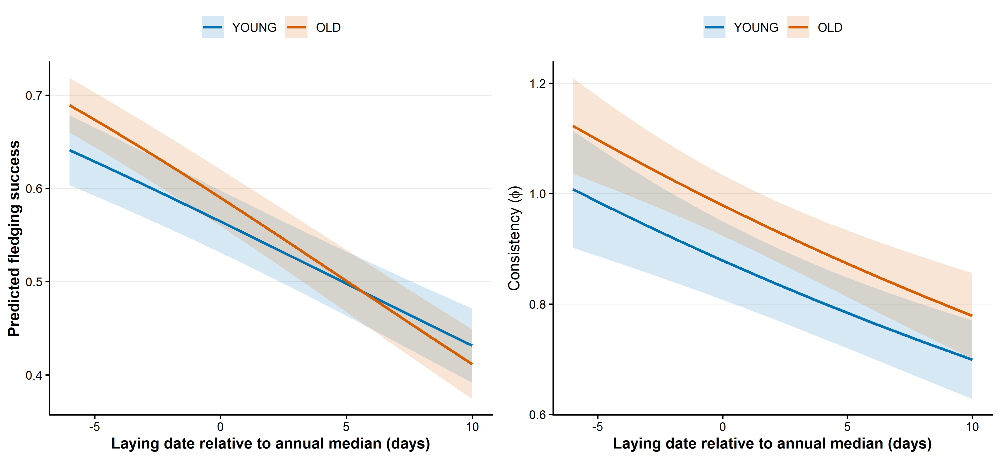
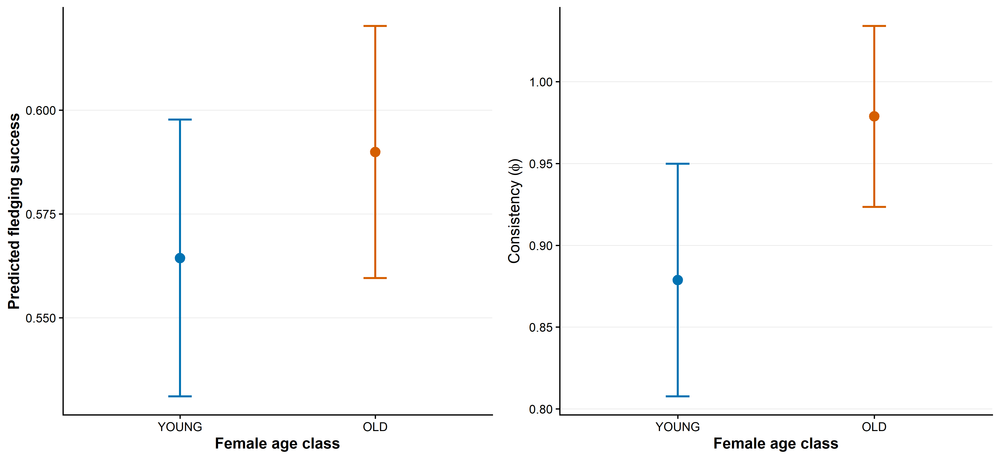
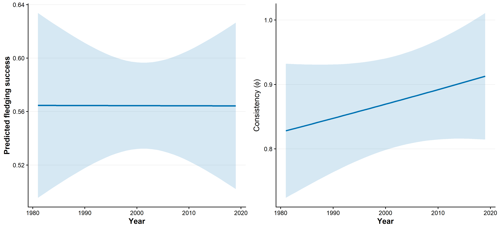
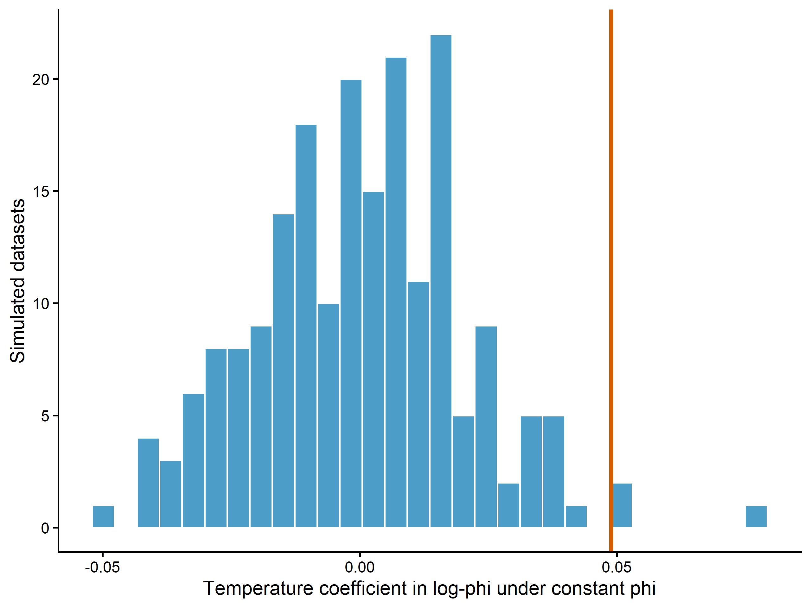
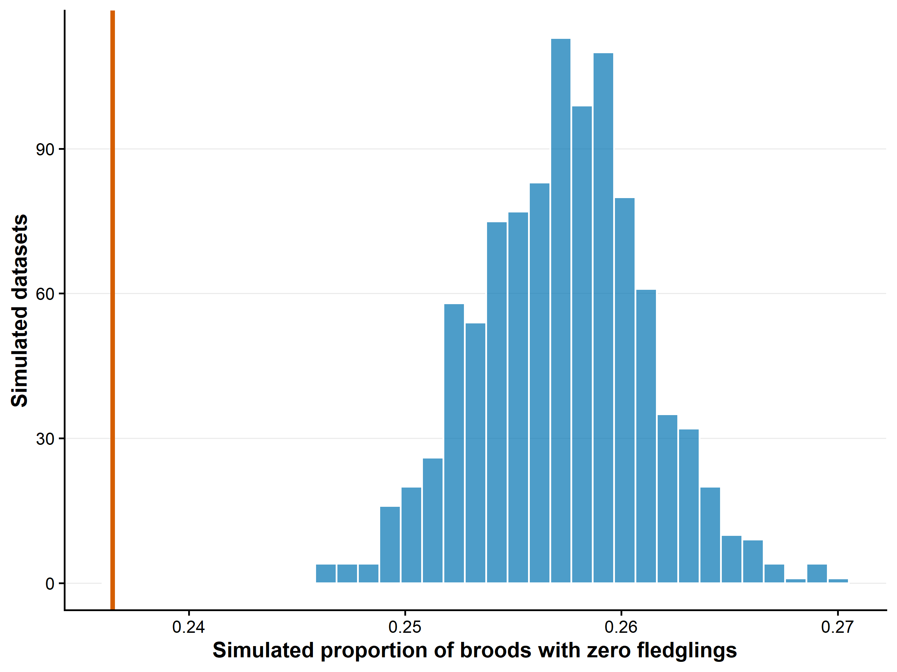
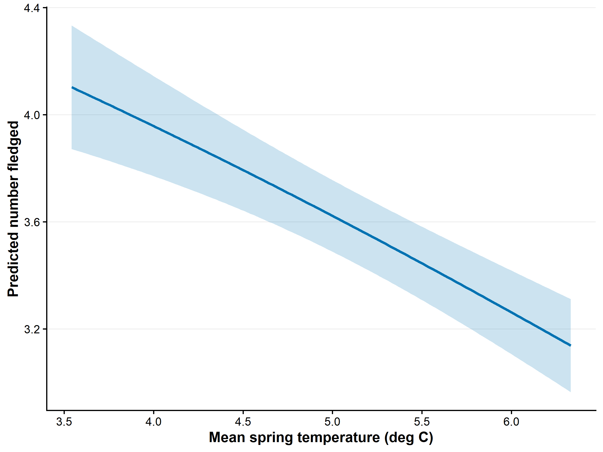
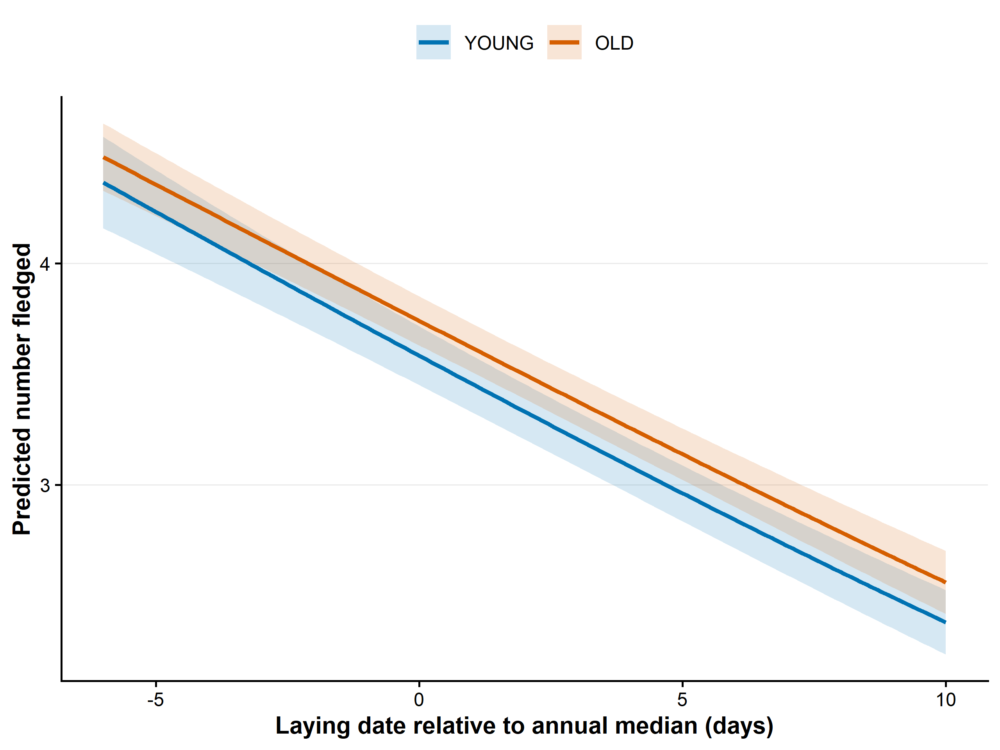

```{r}
#| label: setup
#| include: false
Sys.setlocale("LC_TIME", "C")
library(dplyr)
library(knitr)
library(readr)

fmt <- function(x, digits = 3) formatC(as.numeric(x), digits = digits, format = "f")
fmt_p <- function(x) ifelse(x < 0.001, "< 0.001", paste0("= ", fmt(x, 3)))
ci_low <- function(beta, se) beta - 1.96 * se
ci_high <- function(beta, se) beta + 1.96 * se

dat <- read_csv("data_derived/fledging_model_data.csv", show_col_types = FALSE)
final_relLD_checks <- dat |>
  group_by(year_f) |>
  summarise(annual_median = median(rel_LD), .groups = "drop")
max_abs_annual_median_relLD <- max(abs(final_relLD_checks$annual_median))
cor_relLD_temperature <- cor(dat$rel_LD, dat$temp_mean_c)
source_fs <- read_csv("data_derived/reproductive_model_data.csv", show_col_types = FALSE) |>
  filter(!is.na(fledged))
sample_tab <- read_csv("tables/fledging_chapter_sample_summary.csv", show_col_types = FALSE)
bb_compare <- read_csv("tables/fledging_bb_precision_comparison.csv", show_col_types = FALSE)
main_coef <- read_csv("tables/fledging_bb_main_coefficients.csv", show_col_types = FALSE) |>
  mutate(
    CI_low = ci_low(beta, SE), CI_high = ci_high(beta, SE),
    direction = case_when(
      component != "precision_log_phi" ~ "",
      beta > 0 ~ "higher phi: lower conditional heterogeneity",
      beta < 0 ~ "lower phi: higher conditional heterogeneity",
      TRUE ~ "no directional change"
    )
  )
variance_decomp <- read_csv("tables/fledging_variance_decomposition.csv", show_col_types = FALSE)
temporal_success <- read_csv("tables/fig5_4a_success_year.csv", show_col_types = FALSE)
temporal_phi <- read_csv("tables/fig5_4b_phi_year.csv", show_col_types = FALSE)
age_trends <- read_csv("tables/fledging_relLD_age_emtrends.csv", show_col_types = FALSE)
zero_summary <- read_csv("tables/fledging_zero_frequency_summary.csv", show_col_types = FALSE)
zero_conditional <- read_csv(
  "tables/fledging_zero_frequency_conditional_summary.csv",
  show_col_types = FALSE
)
count_zero <- read_csv("tables/fledged_count_zero_frequency_summary.csv", show_col_types = FALSE)
hurdle_compare <- read_csv("tables/fledged_count_hurdle_optimizer_comparison.csv", show_col_types = FALSE)
hurdle_coef <- read_csv("tables/fledged_count_hurdle_coefficients.csv", show_col_types = FALSE) |>
  mutate(CI_low = ci_low(beta, SE), CI_high = ci_high(beta, SE))
hurdle_zero <- read_csv("tables/fledged_count_hurdle_zero_frequency_summary.csv", show_col_types = FALSE)
positive_dispersion <- read_csv("tables/fledged_hurdle_positive_dispersion_summary.csv", show_col_types = FALSE)
phi_mechanism <- read_csv("tables/fledging_phi_temperature_constant_simulation_summary.csv", show_col_types = FALSE)
phi_survival <- read_csv("tables/fledging_phi_temperature_conditional_survival.csv", show_col_types = FALSE)
precision_age_cmp <- read_csv("tables/fledging_precision_relLD_age_anova.csv", show_col_types = FALSE)
precision_age_int <- read_csv("tables/fledging_precision_relLD_age_interaction.csv", show_col_types = FALSE)
phi_survival_temp <- phi_survival |>
  filter(sample == "positive_broods_zero_truncated_joint",
         term == "precision:temp_mean_c") |>
  slice(1)
diagnostics <- read_csv("tables/fledging_chapter_diagnostics.csv", show_col_types = FALSE)
clutch_coef <- read_csv("tables/brms_cs_main_no_tempsd_coefficients.csv", show_col_types = FALSE)
count_temp_predictions <- read_csv("tables/fig5_5_fledged_count_temperature.csv", show_col_types = FALSE)

get_bb <- function(component_name, term_name) {
  main_coef |> filter(component == component_name, term == term_name) |> slice(1)
}
get_hurdle <- function(component_name, term_name) {
  hurdle_coef |> filter(component == component_name, term == term_name) |> slice(1)
}
temp_center <- read_csv("tables/fledging_bb_centring_constants.csv", show_col_types = FALSE)$temp_mean[1]
pred_low <- count_temp_predictions |>
  slice_min(abs(temp_mean - (temp_center - 0.5)), n = 1, with_ties = FALSE)
pred_high <- count_temp_predictions |>
  slice_min(abs(temp_mean - (temp_center + 0.5)), n = 1, with_ties = FALSE)
marginal_temp_percent <- 100 * (pred_high$estimate / pred_low$estimate - 1)

source_1981_2019 <- source_fs |> filter(between(year, 1981, 2019))
source_known_age <- source_1981_2019 |> filter(age_class %in% c("YOUNG", "OLD"))
sample_reconciliation <- tibble(
  stage = c(
    "Validated fledging records, 1981-2019",
    "After restricting to 1981-2019",
    "After requiring the binary age class",
    "After requiring laying date for rel_LD"
  ),
  broods = c(nrow(source_fs), nrow(source_1981_2019), nrow(source_known_age), nrow(dat)),
  zero_broods = c(
    sum(source_fs$fledged == 0), sum(source_1981_2019$fledged == 0),
    sum(source_known_age$fledged == 0), sum(dat$fledged == 0)
  )
)
```

## Data

The main response is **egg-to-fledging success, defined as the number of fledglings relative to the number of eggs laid**. Hereafter, *fledging success* is used as shorthand for this egg-to-fledging measure; the denominator is not the number of hatched nestlings.

The model-ready data span `r sample_tab$years` (`r sample_tab$seasons` seasons) and contain `r format(sample_tab$broods, big.mark = ",")` broods from `r format(sample_tab$females, big.mark = ",")` females. Complete brood failure occurred in `r format(sample_tab$zero_broods, big.mark = ",")` broods (`r fmt(sample_tab$zero_percent, 1)`%). All zero-fledgling broods are retained. Records after 2019 are excluded because they have not yet been validated.

`rel_LD` is laying date minus the annual median laying date, recalculated after all restrictions defining the final fledging-model sample. It describes a female's timing relative to other females breeding in the same season; it is not a measure of phenological mismatch. `temp_mean_c` and `year_c` retain the existing centring definitions.

The predictors operate at different hierarchical levels. Relative laying date is centred within season and is therefore identified primarily by comparisons among broods breeding in the same year; the model contains `r format(sample_tab$broods, big.mark = ",")` brood records, with repeated observations of females accounted for by the female random intercept. Spring temperature and year vary only among seasons, so inference for these predictors is based on variation across `r sample_tab$seasons` breeding seasons. Consequently, annual predictors are estimated from substantially fewer independent temporal units than within-season predictors.

Within-season centring separates variation in reproductive timing among females within a season from differences among seasons. In the final analytical sample, `rel_LD` was recalculated as laying date minus the annual median laying date after all analytical filters; the maximum absolute annual median was `r format(max_abs_annual_median_relLD, scientific = TRUE, digits = 3)` days (floating-point zero). The observed correlation with spring temperature was $r$ = `r fmt(cor_relLD_temperature, 4)`.

| Years | Seasons | Broods | Females | Broods with zero fledglings | Zero broods (%) |
|---|---:|---:|---:|---:|---:|
| `r sample_tab$years` | `r sample_tab$seasons` | `r format(sample_tab$broods, big.mark = ",")` | `r format(sample_tab$females, big.mark = ",")` | `r format(sample_tab$zero_broods, big.mark = ",")` | `r fmt(sample_tab$zero_percent, 1)` |

```{r}
#| echo: false
kable(
  sample_reconciliation,
  col.names = c("Sample definition", "Broods", "Complete failures"),
  caption = "Reconciliation of the validated fledging series with the model-ready sample."
)
```

## Beta-binomial model structure

### Constant versus predictor-dependent precision

Two otherwise identical beta-binomial models were compared on the full dataset, including broods with zero fledglings. This comparison asks specifically whether allowing beta-binomial precision to vary with the prespecified predictors improves the model of fledging success.

```{r}
#| eval: false
#| code-fold: true
#| code-summary: "Show model call"
#| filename: "R/30_fledging_chapter_models_figures.R"
m_bb_constant <- glmmTMB(
  cbind(fledged, clutch - fledged) ~
    rel_LD * age_class + temp_mean_c + year_c +
    (1 | year_f) + (1 | female_id),
  dispformula = ~ 1,
  family = betabinomial(), data = dat
)

m_bb_scale <- glmmTMB(
  cbind(fledged, clutch - fledged) ~
    rel_LD * age_class + temp_mean_c + year_c +
    (1 | year_f) + (1 | female_id),
  dispformula = ~ rel_LD + temp_mean_c + year_c + age_class,
  family = betabinomial(), data = dat
)
```

```{r}
#| echo: false
kable(
  bb_compare |> select(model, df, AIC, BIC, logLik, LR_chisq, LRT_df, LRT_p,
                       delta_AIC, delta_BIC),
  digits = 3,
  col.names = c("Model", "df", "AIC", "BIC", "logLik", "LR chi-square",
                "df (LRT)", "p", "Delta AIC", "Delta BIC"),
  caption = "Beta-binomial model comparison on the complete brood sample."
)
```

The predictor-dependent precision model was clearly supported over the constant-precision model (likelihood-ratio $\chi^2_{`r bb_compare$LRT_df[2]`}$ = `r fmt(bb_compare$LR_chisq[2], 2)`, $p$ `r fmt_p(bb_compare$LRT_p[2])`; $\Delta$AIC = `r fmt(bb_compare$delta_AIC[1], 1)`, $\Delta$BIC = `r fmt(bb_compare$delta_BIC[1], 1)`). It is therefore retained as the main model. This support comes from the beta-binomial response itself, not from a Gaussian model of positive fledgling counts.

## Main beta-binomial location-scale model

The location equation contains relative laying date, age class, their interaction, spring temperature, and time, with random intercepts for year and female. The precision equation contains relative laying date, spring temperature, time, and age class. Larger $\phi$ indicates lower conditional extra-binomial heterogeneity; smaller $\phi$ indicates higher conditional extra-binomial heterogeneity. This is conditional residual heterogeneity, not total phenotypic variance.

```{r}
#| echo: true
#| code-fold: true
#| code-summary: "Load saved model"
m_bb_scale <- readRDS("models/glmmTMB/fledging_bb_main_no_tempsd.rds")
```

<details class="model-summary">
<summary>Show complete coefficient table</summary>

```{r}
#| eval: false
#| code-fold: false
summary(m_bb_scale)
```

```{r}
#| echo: true
#| code-fold: true
kable(
  main_coef |> select(component, term, beta, SE, CI_low, CI_high, z, p, direction),
  digits = 4,
  col.names = c("Component", "Term", "Beta", "SE", "95% CI low", "95% CI high",
                "z", "p", "Direction"),
  caption = "Location and precision coefficients from the main beta-binomial model."
)
```

</details>

**Create coefficient tables and prediction data.** This step reads the saved model and creates the cached outputs used below.

```{r}
#| eval: false
#| code-fold: true
#| code-summary: "Show output-generation step"
#| filename: "R/30_fledging_chapter_models_figures.R"
source("R/30_fledging_chapter_models_figures.R")
```

## Between-year and between-female variation

```{r}
#| echo: false
kable(
  variance_decomp |> filter(
    grepl("random-intercept SD", quantity) |
      grepl("Reduction in year random-intercept variance", quantity)
  ), digits = 3,
  col.names = c("Component", "Quantity", "Estimate", "Scale or unit"),
  caption = "Random-effect standard deviations and nested-model reductions in year variance for fledging success."
)
```

The year random-intercept SD was `r fmt(variance_decomp$estimate[variance_decomp$quantity == "Year random-intercept SD"], 3)` and the female random-intercept SD was `r fmt(variance_decomp$estimate[variance_decomp$quantity == "Female random-intercept SD"], 3)`, both on the logit scale. The two reduction estimates compare the year random-intercept variance with nested models that omit both seasonal predictors or retain temperature alone; they replace the previous, non-additive variance-of-the-linear-predictor shares. These quantities are not a decomposition of total phenotypic variance and are not directly comparable with $R^2$. The precision equation contains no random year or female effects, so no analogous random-effect SD is defined for $\phi$.

### Fledging success and spring temperature

```{r}
#| echo: false
#| fig-cap: "Population-level predictions against spring temperature from the beta-binomial model. Left: mean fledging success. Right: conditional consistency, expressed as phi. Random effects are excluded; ribbons are 95% confidence intervals and the x-axis covers the 5th-95th percentiles of observed temperature."

```

[Show the plotting code in Figure code](figure_code.html#mean-and-consistency-against-temperature).

Warmer springs were associated with lower mean fledging success ($\beta$ = `r fmt(get_bb("location", "temp_mean_c")$beta, 3)`, 95% CI `r fmt(get_bb("location", "temp_mean_c")$CI_low, 3)` to `r fmt(get_bb("location", "temp_mean_c")$CI_high, 3)`, $p$ `r fmt_p(get_bb("location", "temp_mean_c")$p)`) and higher precision ($\beta_{\log\phi}$ = `r fmt(get_bb("precision_log_phi", "temp_mean_c")$beta, 3)`, $p$ `r fmt_p(get_bb("precision_log_phi", "temp_mean_c")$p)`). Thus, both the location and scale effects of temperature were supported: fledging success was lower but conditionally more consistent in warmer springs.

### Fledging success and relative laying date

```{r}
#| echo: false
#| fig-cap: "Population-level predictions against relative laying date for young and old females from the beta-binomial location-scale model. Left: mean fledging success. Right: conditional consistency, expressed as phi. The precision equation contains additive effects of relative laying date and age but no interaction, so its age-specific curves have a common slope on the log-phi scale. Random effects are excluded; ribbons are 95% confidence intervals."

```

[Show the plotting code in Figure code](figure_code.html#fledging-success-figures).

Relatively later females had lower fledging success. The relative-laying-date slope differed between age classes ($\beta_{\mathrm{LD\times OLD}}$ = `r fmt(get_bb("location", "rel_LD:age_classOLD")$beta, 3)`, 95% CI `r fmt(get_bb("location", "rel_LD:age_classOLD")$CI_low, 3)` to `r fmt(get_bb("location", "rel_LD:age_classOLD")$CI_high, 3)`, $p$ `r fmt_p(get_bb("location", "rel_LD:age_classOLD")$p)`). The `rel_LD` main coefficient is conditional on the reference class, `age_class = YOUNG`.

Conditional slopes were calculated with `emmeans::emtrends()` using the full variance-covariance matrix.

```{r}
#| echo: false
kable(
  age_trends, digits = 4,
  caption = "Conditional relative-laying-date slopes by age class with 95% confidence intervals."
)
```

Log-$\phi$ decreased with relative laying date ($\beta$ = `r fmt(get_bb("precision_log_phi", "rel_LD")$beta, 3)`, 95% CI `r fmt(get_bb("precision_log_phi", "rel_LD")$CI_low, 3)` to `r fmt(get_bb("precision_log_phi", "rel_LD")$CI_high, 3)`, $p$ `r fmt_p(get_bb("precision_log_phi", "rel_LD")$p)`). Thus, each one-day delay multiplied $\phi$ by `r fmt(exp(get_bb("precision_log_phi", "rel_LD")$beta), 3)` (`r fmt(100 * (exp(get_bb("precision_log_phi", "rel_LD")$beta) - 1), 1)`%), indicating greater conditional extra-binomial heterogeneity at later relative laying dates.

<details>
<summary><strong>Check of the <code>rel_LD × age_class</code> interaction in precision</strong></summary>

Adding a `rel_LD × age_class` interaction to the precision equation provided no clear evidence of age-specific slopes (likelihood-ratio $\chi^2_1$ = `r fmt(precision_age_cmp$chi_square[2], 2)`, $p$ `r fmt_p(precision_age_cmp$p[2])`); the models were essentially indistinguishable by AIC ($\Delta$AIC = `r fmt(abs(diff(precision_age_cmp$AIC)), 2)`). The interaction coefficient was $\beta_{\log\phi}$ = `r fmt(precision_age_int$beta, 4)` (95% CI `r fmt(precision_age_int$CI_low, 4)` to `r fmt(precision_age_int$CI_high, 4)`, $p$ `r fmt_p(precision_age_int$p)`). We therefore retained the simpler additive precision model, in which the age-specific curves share a relative-laying-date slope on the log-$\phi$ scale.

</details>

### Fledging success and female age

Older females had higher mean fledging success at the reference relative laying date ($\beta$ = `r fmt(get_bb("location", "age_classOLD")$beta, 3)`, $p$ `r fmt_p(get_bb("location", "age_classOLD")$p)`) and higher precision ($\beta_{\log\phi}$ = `r fmt(get_bb("precision_log_phi", "age_classOLD")$beta, 3)`, $p$ `r fmt_p(get_bb("precision_log_phi", "age_classOLD")$p)`). Thus, both the location and scale age effects were supported; the location coefficient is conditional on `rel_LD = 0` because the location equation contains `rel_LD × age_class`.

```{r}
#| echo: false
#| fig-cap: "Model-estimated mean fledging success (left) and beta-binomial consistency (right) for young and old females at the reference relative laying date, mean spring temperature, and mean study year. Points are population-level predictions; error bars are 95% confidence intervals and random effects are excluded."

```

[Show the plotting code in Figure code](figure_code.html#mean-and-consistency-by-female-age).

### Changes over time

```{r}
#| echo: false
#| fig-cap: "Temporal predictions from the beta-binomial location-scale model after accounting for spring temperature. Left: population-level conditional prediction for mean fledging success. Right: conditional consistency, expressed as phi; higher values indicate greater consistency. Spring temperature is held at its study-wide mean, random effects are excluded, and ribbons show 95% confidence intervals."

```

[Show the plotting code in Figure code](figure_code.html#conditional-temporal-trajectories).

After accounting for spring temperature, there was no clear evidence of temporal change in mean egg-to-fledging success ($\beta$ = `r fmt(get_bb("location", "year_c")$beta, 4)`, 95% CI `r fmt(get_bb("location", "year_c")$CI_low, 4)` to `r fmt(get_bb("location", "year_c")$CI_high, 4)`, $p$ `r fmt_p(get_bb("location", "year_c")$p)`). Reproductive consistency likewise showed no clear temporal trend ($\beta_{\log\phi}$ = `r fmt(get_bb("precision_log_phi", "year_c")$beta, 4)`, 95% CI `r fmt(get_bb("precision_log_phi", "year_c")$CI_low, 4)` to `r fmt(get_bb("precision_log_phi", "year_c")$CI_high, 4)`, $p$ `r fmt_p(get_bb("precision_log_phi", "year_c")$p)`).

<details>
<summary><strong>Appendix: checks of the temperature effect on precision</strong></summary>

The temperature effect on $\phi$ was not explained by the changing mean or the response ceiling (constant-$\phi$ simulation: exceeded in `r fmt(100 * phi_mechanism$proportion_at_least_observed, 1)`% of replicates), and it remained positive after conditioning on broods with at least one fledgling in a zero-truncated beta-binomial model ($\beta_{\log\phi}$ = `r fmt(phi_survival_temp$beta, 3)`, 95% CI `r fmt(phi_survival_temp$CI_low, 3)` to `r fmt(phi_survival_temp$CI_high, 3)`, $p$ `r fmt_p(phi_survival_temp$p)`).

To assess whether the temperature effect on $\phi$ could arise mechanically because mean success moved away from the upper boundary, 200 datasets were simulated with the fitted conditional means held fixed but with constant $\phi$. The median simulated temperature coefficient in an auxiliary precision model was `r fmt(phi_mechanism$simulated_median, 4)` (95% simulation interval `r fmt(phi_mechanism$simulation_CI_low, 4)` to `r fmt(phi_mechanism$simulation_CI_high, 4)`). The corresponding observed auxiliary coefficient was `r fmt(phi_mechanism$observed_auxiliary_beta, 4)`; only `r fmt(100 * phi_mechanism$proportion_at_least_observed, 1)`% of simulations were at least this large. All `r phi_mechanism$simulations` optimisations converged without reaching parameter boundaries. This targeted check does not distinguish biological from other unmodelled sources of conditional heterogeneity.

```{r}
#| echo: false
#| fig-cap: "Temperature coefficients from 200 datasets simulated with constant phi. The orange line is the observed auxiliary coefficient. This is a diagnostic figure, not a biological effect estimate."

```

[Show the plotting code in Figure code](figure_code.html#constant-phi-simulation-diagnostic).

To determine whether higher $\phi$ in warmer springs was instead produced by the increased probability of complete brood failure, a correctly zero-truncated beta-binomial likelihood was fitted to the `r sum(dat$fledged > 0)` broods with at least one fledgling. The location and precision equations were jointly re-estimated, while the fitted year and female contributions were retained as offsets. The temperature coefficient in precision remained positive ($\beta_{\log\phi}$ = `r fmt(phi_survival_temp$beta, 4)`, 95% CI `r fmt(phi_survival_temp$CI_low, 4)` to `r fmt(phi_survival_temp$CI_high, 4)`, $p$ `r fmt_p(phi_survival_temp$p)`). The optimisation converged without a boundary estimate. Thus, the association is not attributable solely to warmer springs producing more complete failures and leaving a more homogeneous surviving subset. It may be discussed as higher conditional residual consistency among non-failed broods, but not as evidence of a causal temperature effect or a change in total phenotypic variance.

</details>

<details>
<summary><strong>Model adequacy for complete brood failures</strong></summary>

#### Simulation-based zero-frequency check

Two simulation checks address different questions. First, 1,000 datasets were simulated with the fitted year and female random effects held fixed, directly assessing calibration for the observed groups. Second, `simulate.glmmTMB()` was used to generate new random-effect realisations from their estimated distributions, assessing unconditional calibration for hypothetical new groups. The current `glmmTMB` implementation cannot condition `simulate()` on the fitted random effects, so the conditional check was generated directly from the fitted beta-binomial means and precision values.

```{r}
#| echo: false
#| fig-cap: "Distribution of the proportion of complete brood failures in 1,000 datasets simulated conditionally on the fitted year and female random effects. The orange vertical line is the observed proportion."

```

[Show the plotting code in Figure code](figure_code.html#fledging-success-figures).

The observed frequency was `r fmt(100 * zero_conditional$observed, 1)`%. Conditional simulations had a median of `r fmt(100 * zero_conditional$simulated_median, 1)`% (95% simulation interval `r fmt(100 * zero_conditional$simulation_CI_low, 1)`–`r fmt(100 * zero_conditional$simulation_CI_high, 1)`%), whereas unconditional `simulate.glmmTMB()` simulations had a median of `r fmt(100 * zero_summary$simulated_median, 1)`% (95% simulation interval `r fmt(100 * zero_summary$simulation_CI_low, 1)`–`r fmt(100 * zero_summary$simulation_CI_high, 1)`%). Thus, the conditional check underpredicted zeros while the unconditional check overpredicted them. The fitted model does not reproduce the observed zero frequency exactly, but the direction of the discrepancy depends on whether inference is conditional on the observed groups or averaged over new random-effect realisations. This is a model-adequacy diagnostic, not a separate biological hypothesis test, and does not by itself justify an additional zero-inflation component.

</details>

<!-- The realised fledgling production analysis is now maintained in
realised_fledgling_production.qmd. The archived source below is excluded
from this chapter's rendered output.

## Realised fledgling production

Absolute fledgling production is the number of fledglings produced per brood. It is analysed separately from fledging success and does not include clutch size as a covariate, because clutch size is a responsive reproductive trait and may mediate the total effect of temperature and timing.

This analysis does not contain a scale equation. Neither the Bernoulli complete-failure component nor the zero-truncated Poisson positive-count component has a freely estimated dispersion parameter. Consequently, the hurdle model addresses realised output and failure risk, not reproductive consistency; consistency is evaluated in the Gaussian clutch-size and beta-binomial fledging-success models.

### Model specification

```{r}
#| eval: false
#| code-fold: show
#| filename: "R/30_fledging_chapter_models_figures.R"
m_count_hurdle <- glmmTMB(
  fledged ~ rel_LD * age_class + temp_mean_c + year_c +
    (1 | year_f) + (1 | female_id),
  ziformula = ~ rel_LD + temp_mean_c + year_c + age_class,
  family = truncated_poisson(), data = dat
)
```

The ordinary NB2 model is retained only as a sensitivity check because it reproduced `r fmt(100 * count_zero$simulated_median, 1)`% zero broods versus `r fmt(100 * count_zero$observed, 1)`% observed; the hurdle-Poisson is the final model of realised fledgling production.

::: {.callout-note collapse="true"}
### Model diagnostics

A hurdle model was fitted to separate the probability of complete failure from the positive fledgling-count distribution. After alternative optimisation, both hurdle-NB2 and hurdle-Poisson converged with positive-definite Hessians. Their log-likelihoods were effectively identical, and the simpler hurdle-Poisson had lower AIC and BIC.

```{r}
#| echo: false
kable(
  hurdle_compare, digits = 3,
  col.names = c("Model", "Convergence", "pdHess", "AIC", "BIC", "logLik"),
  caption = "Comparison of the two fitted hurdle count distributions."
)
```

All fitted models had convergence code zero and a positive-definite Hessian.

```{r}
#| echo: false
kable(diagnostics, caption = "Numerical convergence checks for the fitted models.")
```

The hurdle-Poisson reproduced the observed zero frequency: observed `r fmt(100 * hurdle_zero$observed, 2)`%, simulated median `r fmt(100 * hurdle_zero$simulated_median, 2)`%, and 95% simulation interval `r fmt(100 * hurdle_zero$simulation_CI_low, 2)`-`r fmt(100 * hurdle_zero$simulation_CI_high, 2)`%. This resolves the major zero-frequency failure of the ordinary NB2 model.

The positive-count component was not overdispersed. Its conditional Pearson dispersion was `r fmt(positive_dispersion$observed_Pearson_dispersion, 3)`, compared with a median of `r fmt(positive_dispersion$simulated_median, 3)` and a 95% simulation interval of `r fmt(positive_dispersion$simulation_CI_low, 3)`-`r fmt(positive_dispersion$simulation_CI_high, 3)` under the fitted zero-truncated Poisson. The observed value indicates underdispersion rather than overdispersion. Consistently, the alternative hurdle-NB2 estimated $\theta$ = `r format(positive_dispersion$hurdle_nbinom2_theta, scientific = TRUE, digits = 3)`, effectively collapsing to the Poisson limit, and had an AIC higher by `r fmt(positive_dispersion$delta_AIC_nbinom2, 2)`. Therefore, `truncated_nbinom2()` offers no improvement, and hurdle-Poisson remains the main realised-output model. The underdispersion means that its Poisson standard errors are conservative.

<details class="model-summary">
<summary>Show absolute-fledged coefficient table</summary>

```{r}
#| echo: false
kable(
  hurdle_coef |> select(component, term, beta, SE, CI_low, CI_high, z, p), digits = 4,
  caption = "Coefficients from the positive-count and complete-failure components of the hurdle-Poisson model."
)
```

</details>

:::

### Temperature and realised fledgling number

```{r}
#| echo: false
#| fig-cap: "Marginal population-level prediction of absolute fledgling production from the hurdle-Poisson model, integrating complete-failure risk and positive fledgling number. Random effects are excluded; the ribbon is a 95% confidence interval."

```

Temperature increased the odds of complete brood failure ($\beta_{zero}$ = `r fmt(get_hurdle("zero_probability", "temp_mean_c")$beta, 3)`, 95% CI `r fmt(get_hurdle("zero_probability", "temp_mean_c")$CI_low, 3)` to `r fmt(get_hurdle("zero_probability", "temp_mean_c")$CI_high, 3)`, $p$ `r fmt_p(get_hurdle("zero_probability", "temp_mean_c")$p)`) and reduced the expected number fledged among positive broods ($\beta_{positive}$ = `r fmt(get_hurdle("positive_count", "temp_mean_c")$beta, 3)`, 95% CI `r fmt(get_hurdle("positive_count", "temp_mean_c")$CI_low, 3)` to `r fmt(get_hurdle("positive_count", "temp_mean_c")$CI_high, 3)`, $p$ `r fmt_p(get_hurdle("positive_count", "temp_mean_c")$p)`). The integrated population-level prediction declined by approximately `r fmt(abs(marginal_temp_percent), 1)`% across a 1 &deg;C contrast centred on the mean temperature. Clutch size increased with temperature ($\beta$ = `r fmt(clutch_coef$median[clutch_coef$component == "location" & clutch_coef$term == "temp_mean_c"], 3)` eggs per 1 &deg;C), but this increase was insufficient to compensate for lower fledging success and increased complete-failure risk.

### Relative laying date and age effects

```{r}
#| echo: false
#| fig-cap: "Marginal population-level predictions of absolute fledgling production from the hurdle-Poisson model, integrating complete-failure risk and positive fledgling number. Random effects are excluded; ribbons are 95% confidence intervals."

```

Later relative laying date increased complete-failure risk ($\beta_{zero}$ = `r fmt(get_hurdle("zero_probability", "rel_LD")$beta, 4)`, $p$ `r fmt_p(get_hurdle("zero_probability", "rel_LD")$p)`) and reduced fledgling number among positive broods ($\beta_{positive}$ = `r fmt(get_hurdle("positive_count", "rel_LD")$beta, 4)`, $p$ `r fmt_p(get_hurdle("positive_count", "rel_LD")$p)`). Older females produced more fledglings in the positive-count component at the reference relative laying date ($\beta$ = `r fmt(get_hurdle("positive_count", "age_classOLD")$beta, 3)`, $p$ `r fmt_p(get_hurdle("positive_count", "age_classOLD")$p)`). The `rel_LD` by age interaction was not supported in the positive-count component ($\beta$ = `r fmt(get_hurdle("positive_count", "rel_LD:age_classOLD")$beta, 3)`, $p$ `r fmt_p(get_hurdle("positive_count", "rel_LD:age_classOLD")$p)`), and there was no supported long-term trend there ($\beta_{year}$ = `r fmt(get_hurdle("positive_count", "year_c")$beta, 4)`, $p$ `r fmt_p(get_hurdle("positive_count", "year_c")$p)`).

-->

## Figure data and reproducibility

Run [`R/09_prepare_reproductive_model_data.R`](R/09_prepare_reproductive_model_data.R), then [`R/45_recentre_final_fledging_relLD.R`](R/45_recentre_final_fledging_relLD.R), fit the models and outputs with [`R/30_fledging_chapter_models_figures.R`](R/30_fledging_chapter_models_figures.R), refresh the paired figures with [`R/30c_refresh_phi_figures.R`](R/30c_refresh_phi_figures.R), refresh the constant-$\phi$ diagnostic with [`R/49_refresh_phi_constant_simulation.R`](R/49_refresh_phi_constant_simulation.R), run the conditional zero-frequency simulation with [`R/51_fledging_conditional_zero_simulation.R`](R/51_fledging_conditional_zero_simulation.R), generate its diagnostic figure with [`R/52_plot_fledging_conditional_zero_diagnostic.R`](R/52_plot_fledging_conditional_zero_diagnostic.R), and finally render this chapter.

- [Figure 5.1 data](tables/fig5_1_success_temperature.csv){download="fig5_1_success_temperature.csv"}
- [Figure 5.1 consistency data](tables/fig5_1b_phi_temperature.csv){download="fig5_1b_phi_temperature.csv"}
- [Figure 5.2 data](tables/fig5_2_success_rellD_age.csv){download="fig5_2_success_rellD_age.csv"}
- [Figure 5.3 data](tables/fig5_3_phi_rellD.csv){download="fig5_3_phi_rellD.csv"}
- [Age and mean fledging-success data](tables/fig5_3a_success_age.csv){download="fig5_3a_success_age.csv"}
- [Age and consistency data](tables/fig5_3b_phi_age.csv){download="fig5_3b_phi_age.csv"}
- [Time and mean fledging-success data](tables/fig5_4a_success_year.csv){download="fig5_4a_success_year.csv"}
- [Time and consistency data](tables/fig5_4b_phi_year.csv){download="fig5_4b_phi_year.csv"}
- [Precision interaction model comparison](tables/fledging_precision_relLD_age_anova.csv){download="fledging_precision_relLD_age_anova.csv"}
- [Precision interaction coefficient](tables/fledging_precision_relLD_age_interaction.csv){download="fledging_precision_relLD_age_interaction.csv"}
- [Figure 5.4 simulation data](tables/fledging_zero_frequency_simulations.csv){download="fledging_zero_frequency_simulations.csv"}
- [Conditional zero-frequency simulation data](tables/fledging_zero_frequency_conditional_simulations.csv){download="fledging_zero_frequency_conditional_simulations.csv"}
- [Beta-binomial comparison](tables/fledging_bb_precision_comparison.csv){download="fledging_bb_precision_comparison.csv"}
- [Zero-frequency diagnostic summary](tables/fledging_zero_frequency_summary.csv){download="fledging_zero_frequency_summary.csv"}
- [Conditional zero-frequency diagnostic summary](tables/fledging_zero_frequency_conditional_summary.csv){download="fledging_zero_frequency_conditional_summary.csv"}
- [Constant-phi simulation summary](tables/fledging_phi_temperature_constant_simulation_summary.csv){download="fledging_phi_temperature_constant_simulation_summary.csv"}
- [Constant-phi simulation coefficients](tables/fledging_phi_constant_simulations.csv){download="fledging_phi_constant_simulations.csv"}
- [Constant-phi histogram data](tables/figA_phi_constant_simulation.csv){download="figA_phi_constant_simulation.csv"}
- [Temperature effect on phi conditional on brood survival](tables/fledging_phi_temperature_conditional_survival.csv){download="fledging_phi_temperature_conditional_survival.csv"}

[Download the complete chapter script](R/30_fledging_chapter_models_figures.R){download="30_fledging_chapter_models_figures.R"}.
