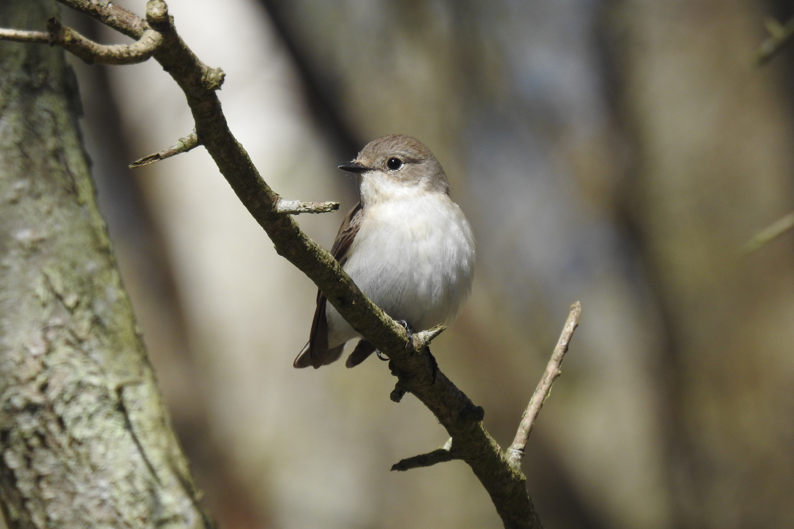

  <video autoplay muted loop playsinline poster="images/cover-flycatcher.jpg" aria-label="Gotland field landscape">
    <source src="media/gotland-background.mp4" type="video/mp4">
  </video>
  

  

  
Arct et al. 2026

  <h1>Warmer springs and reproductive performance in the collared flycatcher</h1>
  

<section class="overview-intro">
  <h2>0.1 Study aims</h2>
  
We asked how spring temperature was associated with reproductive performance in the collared flycatcher, and whether these responses were expressed through changes in average performance, reproductive consistency, or both.

  
Specifically, we tested whether:

  <ul>
    <li>mean temperature during the pre-laying thermal window increased through time and whether its interannual variability changed;</li>
    <li>clutch size and its consistency among females were associated with spring temperature, relative laying date, female age, and long-term time;</li>
    <li>fledging success and its consistency among females were associated with spring temperature, relative laying date, female age, and long-term time.</li>
  </ul>
</section>

<nav class="overview-tiles" aria-label="Project sections">
  <a class="overview-tile" href="climate_window.html">
    Thermal window and temperature data
    How the pre-laying thermal window was selected and how mean temperature changed through time.
  </a>
  <a class="overview-tile" href="data_preparation.html">
    Data and study population
    How temperature, clutch-size, and fledging-success datasets were assembled and validated.
  </a>
  <a class="overview-tile" href="model_structure.html">
    Model structure
    Equations and interpretation for the temperature, clutch-size, and egg-to-fledging-success models.
  </a>
  <a class="overview-tile" href="clutch_size.html">
    Clutch size
    Were reproductive investment and its residual dispersion associated with spring temperature and relative laying date?
  </a>
  <a class="overview-tile" href="fledging_success.html">
    Fledging success
    How fledging success and its conditional consistency varied with temperature, relative timing, and female age.
  </a>
  <a class="overview-tile" href="figure_code.html">
    Figure code
    Reproducible plotting code and downloadable data for all figures.
  </a>
</nav>

<section class="overview-bird-gallery" aria-label="Collared flycatcher photograph">
  <figure class="bird-photo bird-photo-wide">
    
  </figure>
</section>
